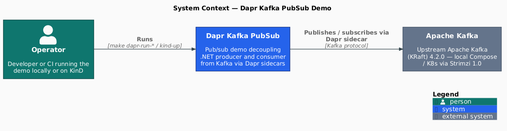
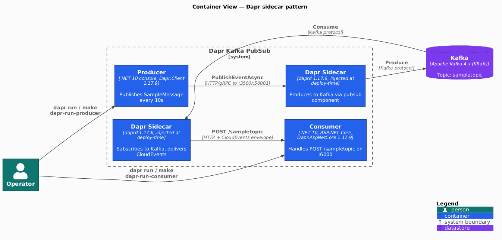
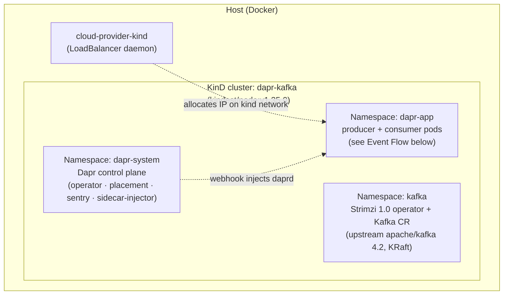
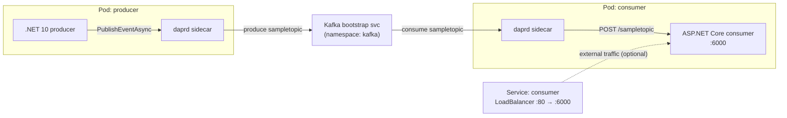

[](https://github.com/AndriyKalashnykov/dapr-kafka-csharp/actions/workflows/ci.yml)
[](https://hits.sh/github.com/AndriyKalashnykov/dapr-kafka-csharp/)
[](https://dotnet.microsoft.com/)
[](https://opensource.org/licenses/MIT)
[](https://app.renovatebot.com/dashboard#github/AndriyKalashnykov/dapr-kafka-csharp)

# Dapr Pub/Sub on Apache Kafka — .NET 10 Starter

Delivers a production-ready Dapr pub/sub implementation in C# on .NET 10: a console producer and an ASP.NET Core consumer exchange `SampleMessage` events through Dapr sidecars over Apache Kafka. The consumer unwraps CloudEvents envelopes via Dapr's middleware, filters on `event.type == com.dapr.event.sent`, and returns RFC 7807 ProblemDetails on malformed input. The same workload runs unchanged on two paths — Docker Compose against `apache/kafka:4.2.0` for fast iteration, or Kubernetes via KinD with Dapr 1.17 (Helm 4) and Strimzi 1.0 provisioning a single-broker KRaft Kafka cluster on the `kafka.strimzi.io/v1` API.

A three-layer test pyramid on TUnit 1.44 + FakeItEasy covers unit (wire schema, publish-loop resilience), integration (consumer HTTP, CloudEvents middleware, and ProblemDetails contract via `WebApplicationFactory`), and end-to-end (full Dapr round-trip on Compose and KinD, with the `e2e-kind` CI job validating the production K8s path on every push). Tag releases pass five supply-chain gates before publishing to GHCR — Trivy CVE scan (CRITICAL/HIGH blocking), `container-structure-test` filesystem and non-root posture checks, boot-marker smoke test, OWASP ZAP DAST baseline against the consumer, and cosign keyless OIDC signing of the multi-arch (`linux/amd64` + `linux/arm64`) digest. Renovate tracks every version pin across `.mise.toml`, `Makefile`, NuGet, `.env`, Dockerfiles, k8s manifests, GitHub Actions, and inline workflow annotations (81 deps across 7 managers).

<p align="center"></p>

## Tech Stack

| Component | Technology | Rationale |
|-----------|-----------|-----------|
| Language | C# on .NET 10 (`10.0.203` via `global.json`) | LTS through 2028-11; matches Dapr.AspNetCore 10 support matrix |
| Runtime image | `mcr.microsoft.com/dotnet/aspnet:10.0` | Required by Dapr.AspNetCore (pulls in ASP.NET runtime) |
| Dapr SDK | `Dapr.AspNetCore`, `Dapr.Client` | Idiomatic sidecar integration with CloudEvents unwrapping |
| Dapr CLI | 1.17.1 (mise-pinned) | Runtime chart is 1.17.6 via `DAPR_CHART_VERSION`; CLI and runtime version independently |
| Message broker | Apache Kafka 4.2.0 | No Zookeeper, KRaft mode. `apache/kafka` official image for local Compose; Strimzi 1.0 operator on K8s pulling `quay.io/strimzi/kafka:1.0.0-kafka-4.2.0` |
| PubSub component | `sampletopic` (pubsub.kafka) | Topic name and component name match by convention |
| Container tooling | Docker + Buildx (multi-arch amd64/arm64) | ARM64 coverage for Apple Silicon and Graviton |
| Kubernetes | KinD + cloud-provider-kind + Dapr Helm chart | Kind-team maintained, single Docker network, host-side LoadBalancer daemon |
| Version manager | mise (aqua backend) | Single source of truth for CLI tooling versions |
| CI/CD | GitHub Actions + Renovate | Platform automerge; SHA-pinned actions; GHCR publishing on tag |

## Quick Start

```bash
make deps                    # bootstrap mise, install CLI toolchain
make build                   # build the solution
docker compose -f ./docker-compose-kafka.yaml up -d   # start Kafka
make dapr-run-consumer       # run consumer with Dapr sidecar (terminal 1)
make dapr-run-producer       # run producer with Dapr sidecar (terminal 2)
```

The `dapr-run-*` targets invoke `dapr run --app-id ... -- dotnet run`. Without the sidecar, `PublishEventAsync` and the topic subscription do not work.

## Prerequisites

| Tool | Version | Purpose |
|------|---------|---------|
| [Git](https://git-scm.com/) | 2.x+ | Version control |
| [GNU Make](https://www.gnu.org/software/make/) | 3.81+ | Build orchestration |
| [mise](https://mise.jdx.dev/) | latest | Installs the CLI toolchain (hadolint, act, dapr, trivy, gitleaks) per `.mise.toml` |
| [.NET SDK](https://dotnet.microsoft.com/download) | 10.0.203 (from `global.json`) | Build and run C# projects |
| [Docker](https://www.docker.com/) | latest | Run Kafka locally, build container images |
| [Dapr CLI](https://docs.dapr.io/getting-started/install-dapr-cli/) | 1.17.1 (mise-pinned) | Run Dapr sidecars locally |
| [KinD](https://kind.sigs.k8s.io/) | 0.31.0 (mise-pinned) | Local Kubernetes cluster (for `make kind-up`) |
| [cloud-provider-kind](https://github.com/kubernetes-sigs/cloud-provider-kind) | 0.10.0 (mise-pinned) | LoadBalancer controller for KinD (allocates IPs on the `kind` Docker network) |
| [Helm](https://helm.sh/) | 4.1.4 (mise-pinned) | Deploy Dapr control plane and Strimzi operator |

Install CLI tooling via mise:

```bash
make deps      # runs `mise install` (no sudo; installs to $HOME/.local/share/mise)
```

## Architecture

### Container View

<p align="center"></p>

- **Producer** is a .NET 10 console app in an infinite loop — generates a `SampleMessage` every 10s and calls `DaprClient.PublishEventAsync("sampletopic", "sampletopic", message)`. Never talks to Kafka directly.
- **Dapr sidecars** are the architectural point: the app sees only HTTP/gRPC to `localhost`; the sidecar owns Kafka connection, serialization, retries, and observability. Pub/sub component config: `components/kafka-pubsub.yaml` (shared by both apps for local Compose) / `k8s/kafka-pubsub.yaml` (Kubernetes).
- **Consumer** uses the legacy `Startup.cs` pattern with `UseCloudEvents()` to unwrap the CloudEvents envelope that the sidecar wraps around delivered messages. `MapPost("sampletopic").WithTopic(...)` registers the subscription with topic filter `event.type == "com.dapr.event.sent"`.
- **JSON serialization** uses `JsonNamingPolicy.CamelCase` on both ends; `SampleMessage` in the `models` library is the shared wire schema.

### Cluster Topology — KinD



### Event Flow — `dapr-app` namespace



- **cloud-provider-kind** runs host-side (not in the cluster) and allocates LoadBalancer IPs on the `kind` Docker network — replaces MetalLB in the portfolio.
- **Sidecar injection**: Dapr's `sidecar-injector` mutating webhook adds the `daprd` container to any pod annotated `dapr.io/enabled: "true"`. Both producer and consumer pods end up 2-container.
- **Kafka** is in a separate namespace, managed by the Strimzi operator (`strimzi/strimzi-kafka-operator` Helm chart, version pinned in `STRIMZI_OPERATOR_VERSION`). The `Kafka` CR uses a single-broker `KafkaNodePool` with `dual-role` (controller + broker) in KRaft mode. Client bootstrap is `dapr-kafka-kafka-bootstrap.kafka.svc.cluster.local:9092`. Strimzi pulls the matching `quay.io/strimzi/kafka:<operator-version>-kafka-<spec.kafka.version>` image — no separate image pin in this repo.
- **Consumer Service** is `type: LoadBalancer` so `e2e/e2e-test.sh` can curl it from the host — otherwise the demo uses Dapr pub/sub, not HTTP ingress.

### Source code layout

```text
producer/           Console app — publishes SampleMessage every 10s
  Program.cs        DaprClient.PublishEventAsync("sampletopic", "sampletopic", ...)

consumer/           ASP.NET Core web app — listens on :6000 (AppBindUrl constant)
  Program.cs        Host builder, binds http://*:6000
  Startup.cs        AddDaprClient + UseCloudEvents + MapPost("sampletopic")
                    Topic filter: event.type == "com.dapr.event.sent"

models/             Shared library (net10.0)
  SampleMessage.cs  CorrelationId, MessageId, Message, CreationDate, Sentiment, PreviousAppTimestamp

tests/              TUnit test projects (unit + integration)
e2e/                KinD + Docker Compose end-to-end shell scripts
```

The C4 **Context** and **Container** heroes are C4-PlantUML — source in [`docs/diagrams/*.puml`](docs/diagrams), rendered to committed PNGs by `make diagrams` (pinned `plantuml/plantuml` Docker image; the C4-PlantUML stdlib is vendored under `docs/diagrams/C4-PlantUML/` so renders need no network). `make diagrams-check` fails the build if a committed PNG drifts from its source or the pinned renderer. The **Cluster Topology** and **Event Flow** views above are inline Mermaid, parsed by `make mermaid-lint` (pinned `minlag/mermaid-cli`). Both gates run on every push as part of `make static-check`.

## Build & Package

Multi-arch images (`linux/amd64`, `linux/arm64`) are built by the `docker` CI job on tag pushes and published to GHCR as `ghcr.io/andriykalashnykov/dapr-kafka-csharp/{producer,consumer}:<semver>`. Both images are digest-pinned in the Dockerfile (`mcr.microsoft.com/dotnet/{aspnet,sdk}:10.0@sha256:…`) for reproducibility. Local builds:

```bash
make image-build          # builds producer and consumer images via Buildx (tagged with current git tag)
make docker-smoke-test    # boot each image and grep for the boot marker (mirrors CI Gate 3)
```

## Deployment

Two paths cover the demo: a host-side Docker Compose flow for fast iteration and a KinD flow that mirrors production sidecar injection. Both rely on Dapr in standalone or cluster mode — the apps themselves never talk to Kafka directly.

### Local (Docker Compose)

Install Dapr in standalone mode (one-time):

```bash
dapr init
```

See [Dapr standalone mode setup](https://docs.dapr.io/getting-started/install-dapr-selfhost/) for details.

Start a single-broker KRaft Kafka (plaintext, auto-creates topics) — the default for the demo:

```bash
docker compose -f ./docker-compose-kafka.yaml up -d
```

A 3-node KRaft cluster (plaintext, no SASL+SSL) is also available via `docker-compose.yaml` — useful for broker-topology testing. It requires a Dapr component change (`brokers: "localhost:9094,localhost:9095,localhost:9096"`):

```bash
make local-kafka-run    # start
make local-kafka-stop   # stop
```

Run consumer and producer with their Dapr sidecars:

```bash
# Terminal 1
make dapr-run-consumer  # cd consumer && dapr run --app-id consumer --app-port 6000 --resources-path ../components -- dotnet run

# Terminal 2
make dapr-run-producer  # cd producer && dapr run --app-id producer --resources-path ../components -- dotnet run
```

Tear down:

```bash
docker compose -f ./docker-compose-kafka.yaml down
```

### Kubernetes (KinD + cloud-provider-kind)

Uses KinD (`kindest/node`) with [cloud-provider-kind](https://github.com/kubernetes-sigs/cloud-provider-kind) for `ServiceType: LoadBalancer`. cloud-provider-kind runs host-side and allocates IPs from the `kind` Docker network; no in-cluster MetalLB.

One-command deploy:

```bash
make kind-up       # create cluster + start cloud-provider-kind + deploy Dapr + Kafka + workloads
make k8s-test      # verify pods healthy and messages flowing end-to-end
make kind-down     # stop cloud-provider-kind and delete the cluster
```

`make kind-up` is an alias for `kind-deploy`; `make kind-down` aliases `kind-destroy`.

Step-by-step (granular — for debugging individual phases):

```bash
make kind-create          # create KinD cluster (image pinned via KIND_NODE_IMAGE, Renovate-tracked)
make kind-setup           # start cloud-provider-kind LoadBalancer daemon (requires sudo)
make k8s-dapr-deploy      # install Dapr via Helm
make k8s-kafka-deploy     # install Strimzi operator + Kafka CR (single-broker KRaft, plaintext)
make k8s-workload-deploy  # build images, kind load docker-image, deploy apps
make k8s-test             # verify message flow
```

Inspect logs (every recipe binds `kubectl` to `--context=kind-dapr-kafka` to prevent cross-cluster bleed when other KinD projects share `~/.kube/config`):

```bash
kubectl --context=kind-dapr-kafka logs -f -l app=producer -c producer -n dapr-app
kubectl --context=kind-dapr-kafka logs -f -l app=consumer -c consumer -n dapr-app
```

Cleanup:

```bash
make k8s-undeploy   # workloads + Kafka + Dapr + cluster
make kind-down      # tear down only the cluster
```

## Available Make Targets

Run `make help` for the generated list.

### Build & Test

| Target | Description |
|--------|-------------|
| `make build` | Build the solution |
| `make test` | Unit tests (in-process, seconds) |
| `make integration-test` | Integration tests against Testcontainers (seconds–tens of seconds, requires Docker) |
| `make e2e` | End-to-end tests — deploys to KinD via `kind-up`, asserts message flow (minutes) |
| `make e2e-compose` | End-to-end tests via Docker Compose (lighter alternative) |
| `make clean` | Remove build artifacts |
| `make format` | Auto-fix code formatting |

### Run

| Target | Description |
|--------|-------------|
| `make dapr-run-producer` | Run producer with Dapr sidecar |
| `make dapr-run-consumer` | Run consumer with Dapr sidecar (app-port 6000) |
| `make image-build` | Build Docker images (tagged with current git tag) |
| `make docker-smoke-test` | Boot each image and grep for the boot marker (mirrors CI Gate 3) |
| `make local-kafka-run` | Start 3-node plaintext KRaft Kafka cluster (advanced) |
| `make local-kafka-stop` | Stop the 3-node Kafka cluster |

### Static checks

| Target | Description |
|--------|-------------|
| `make lint` | Format check + warnings-as-errors + hadolint |
| `make static-check` | Composite: `lint + vulncheck + secrets + trivy-fs + trivy-config + mermaid-lint + diagrams-check + deps-prune-check` |
| `make vulncheck` | `dotnet list package --vulnerable` |
| `make secrets` | gitleaks scan |
| `make trivy-fs` | Trivy filesystem scan (CRITICAL/HIGH) |
| `make trivy-config` | Trivy scan on `k8s/` manifests |
| `make mermaid-lint` | Parse every ```mermaid block in markdown files (pinned `minlag/mermaid-cli`) |
| `make diagrams` | Render C4-PlantUML architecture diagrams to committed PNGs (pinned `plantuml/plantuml`, vendored stdlib) |
| `make diagrams-check` | Fail if a committed diagram PNG drifts from its `.puml` source or the pinned renderer |
| `make vendor-diagrams` | Re-download the pinned C4-PlantUML stdlib (manual bump of `C4_PLANTUML_VERSION`) |
| `make deps-prune-check` | Detect unused transitive NuGet packages (NU1510) |

### CI

| Target | Description |
|--------|-------------|
| `make ci` | Full local CI pipeline (static-check + test + integration-test + build) |
| `make ci-run` | Run GitHub Actions workflow locally via [act](https://github.com/nektos/act) |

### Kubernetes

| Target | Description |
|--------|-------------|
| `make kind-up` | Alias for `kind-deploy` — full KinD stack (cluster + cloud-provider-kind + Dapr + Kafka + workloads) |
| `make kind-down` | Alias for `kind-destroy` — stop cloud-provider-kind and delete the cluster |
| `make k8s-deploy` | Alias for `kind-deploy` (granular) |
| `make k8s-undeploy` | Undeploy workloads + Kafka + Dapr + cluster |
| `make k8s-test` | Verify K8s deployment (pods running, messages flowing) |
| `make deps-k8s` | Check Kubernetes tools (kind, cloud-provider-kind, kubectl, helm, dapr) |
| `make kind-create` / `make kind-destroy` | Create/delete KinD cluster (granular) |
| `make kind-setup` / `make kind-lb-stop` | Start/stop cloud-provider-kind LoadBalancer daemon (granular) |
| `make kind-list` | List KinD clusters |
| `make k8s-dapr-deploy` / `make k8s-dapr-undeploy` | Dapr Helm install/uninstall |
| `make k8s-kafka-deploy` / `make k8s-kafka-undeploy` | Strimzi operator + Kafka CR install/uninstall |
| `make k8s-image-load` | Build images and `kind load docker-image` into the cluster |
| `make k8s-workload-deploy` / `make k8s-workload-undeploy` | Producer + consumer lifecycle |

### Utilities

| Target | Description |
|--------|-------------|
| `make deps` | Install CLI toolchain via mise |
| `make deps-mise` | Install mise (no root required) |
| `make update` | Show outdated NuGet packages |
| `make release` | Create and push a new semver tag |
| `make version` | Print current version tag |
| `make renovate-validate` | Validate Renovate configuration locally |

## CI/CD

GitHub Actions runs on push to `main`, tag pushes (`v*`), and pull requests. The `ci-pass` gate aggregates all upstream jobs into a single required status check for branch protection.

| Job | Triggers | Steps |
|-----|----------|-------|
| **changes** | push, PR, tags | `dorny/paths-filter` detector — sets `outputs.code` so doc-only changes skip heavy jobs without deadlocking the Rulesets gate. Force-true on `refs/tags/*` |
| **static-check** | code change | Format check, warnings-as-errors, hadolint |
| **build** | after static-check | Build the solution |
| **test** | after static-check | Run unit tests, upload results artifact |
| **integration-test** | after static-check | Run integration tests, upload results artifact |
| **e2e** | after build + test | End-to-end tests via Docker Compose (Dapr sidecars + `apache/kafka` broker, full publish→subscribe round-trip) |
| **e2e-kind** | after build + test | End-to-end tests via KinD (`helm/kind-action` → Dapr → Strimzi operator + Kafka CR → workloads → `make k8s-test`) |
| **docker** | tag push (`v*`) | Pre-push hardening (Trivy + container-structure-test + smoke + DAST), multi-arch build, push to GHCR, cosign keyless signing |
| **ci-pass** | always | Aggregate pass/fail gate (single required status check for branch protection) |

### Pre-push image hardening

The `docker` job runs the following gates **before** any image is pushed to GHCR. Any failure blocks the release.

| # | Gate | Catches | Tool |
|---|------|---------|------|
| 1 | Build local single-arch image | Build regressions on the runner architecture | `docker/build-push-action` with `load: true` |
| 2 | **Trivy image scan** (CRITICAL/HIGH blocking) | CVEs in the base image, OS packages, build layers | `aquasecurity/trivy-action` with `image-ref:` |
| 2.5 | **Container structure test** | Image contents and metadata drift — required `.dll` files at `/app`, non-root `USER` UID, ENTRYPOINT/WORKDIR match the Dockerfile, dotnet runtime resolves | `GoogleContainerTools/container-structure-test` v1.22.1 against `tests/structure/{producer,consumer}.yaml` |
| 3 | **Smoke test** | Image boots correctly on its own (boot-marker grep; NOT a health-curl, since both apps depend on the Dapr sidecar) | `docker run` + `docker logs` |
| 3.5 | **DAST — OWASP ZAP baseline** (consumer only) | Passive findings on the consumer's `:6000` endpoint (security headers, TLS posture). Producer skipped — console app, no HTTP listener. `continue-on-error` because the Dapr-coupled consumer rejects every non-CloudEvents request; report uploaded as `zap-baseline-consumer` artifact for triage rather than gating | `ghcr.io/zaproxy/zaproxy:2.17.0 zap-baseline.py` |
| 4 | Multi-arch build + push | Publishes for both `linux/amd64` and `linux/arm64` | `docker/build-push-action` |
| 5 | **Cosign keyless OIDC signing** | Sigstore signature on the manifest digest | `sigstore/cosign-installer` + `cosign sign --yes ...@<digest>` |

Buildkit in-manifest attestations (`provenance` + `sbom`) are disabled (Pattern A) so the image index stays free of `unknown/unknown` platform entries, which lets the GHCR Packages UI render the "OS / Arch" tab for the multi-arch manifest. Cosign keyless signing still provides the Sigstore signature for supply-chain verification.

Verify a published image's signature:

```bash
cosign verify ghcr.io/andriykalashnykov/dapr-kafka-csharp/consumer:<tag> \
  --certificate-identity-regexp 'https://github\.com/AndriyKalashnykov/dapr-kafka-csharp/.+' \
  --certificate-oidc-issuer https://token.actions.githubusercontent.com
```

Local parity with Gate 3 via `make docker-smoke-test`.

A weekly **cleanup** workflow (`cleanup-runs.yml`) prunes runs older than 7 days (minimum 5 retained) and stale pull-request caches.

### Required Secrets and Variables

| Name | Type | Used by | How to obtain |
|------|------|---------|---------------|
| `GITHUB_TOKEN` | Secret | `docker` (GHCR push) | Built-in — no configuration required |

No external secrets or `vars.*` are required.

[Renovate](https://docs.renovatebot.com/) keeps dependencies up to date with platform automerge enabled. Every version pin is tracked: `.mise.toml` (aqua backends + core tools), `Makefile` constants annotated with `# renovate:` (Mermaid CLI, Dapr chart, Strimzi operator), `.env` (Kafka image digest), `*.csproj` (NuGet), Dockerfile `FROM` digests, docker-compose `image:` fields, `k8s/*.yaml` `image:` fields (via the `kubernetes` manager), GitHub Actions `uses:` refs, and inline `# renovate:` annotations above env-block constants in `.github/workflows/*.yml` (container-structure-test, OWASP ZAP).

## Contributing

Contributions welcome — open a PR.

## References

- [Practical Microservices with Dapr and .NET (Packt)](https://github.com/PacktPublishing/Practical-Microservices-with-Dapr-and-.NET/tree/main)
- [ACA DAPR Demo](https://github.com/nissbran/aca-dapr-demo)
- [Apache Kafka with Dapr Bindings in .NET](https://www.c-sharpcorner.com/article/apache-kafka-with-dapr-bindings-in-net/)

## License

MIT — see [LICENSE](./LICENSE).
